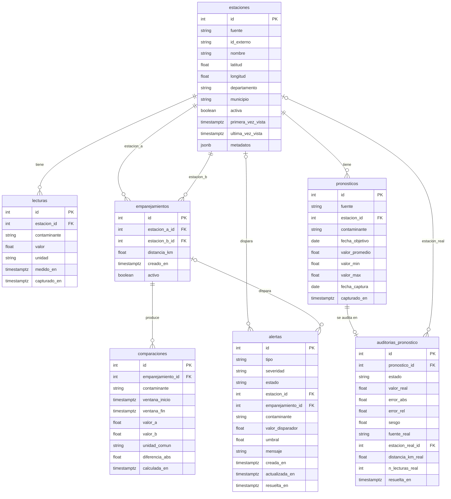

# Modelo de datos de AirE_Online

Base de datos: PostgreSQL 17 (misma mayor que Supabase). Esquema definido en
`engine/database/models.py` y versionado con Alembic (`engine/alembic/versions/`).

## Qué guarda cada tabla

- **estaciones**: una estación física según UNA fuente; la misma estación real puede aparecer una vez por fuente (UNIQUE `fuente + id_externo`).
- **lecturas**: una medición observada, con valor y unidad nativos de la fuente (sin convertir); una por estación, contaminante e instante.
- **emparejamientos**: vínculo entre dos estaciones de fuentes distintas que se consideran la misma zona; cada par se guarda una vez, en orden canónico (`a < b`).
- **comparaciones**: resultado de comparar dos lecturas emparejadas en una ventana de tiempo; lo llena M5.
- **pronosticos**: valor pronosticado capturado de una fuente (hoy AQICN); se guarda lo mínimo para auditar y la API pública expondrá métricas derivadas, no esta serie cruda.
- **auditorias_pronostico**: el veredicto sobre un pronóstico (valor real, error, sesgo); una por pronóstico.
- **alertas**: tarjetas del kanban; un índice único parcial impide dos alertas abiertas iguales.

## Convenciones

- Nombres en español, snake_case, sin tildes; tablas en plural.
- Enumeraciones como VARCHAR + CHECK (no ENUM nativo de Postgres).
- Timestamps `timestamptz` en UTC. Las fechas de `pronosticos` son `date` en hora local de Colombia.
- El horizonte de un pronóstico (`fecha_objetivo - fecha_captura`) no se guarda: es un dato derivado y se calcula al consultar.
- Sin PostGIS: la distancia entre estaciones se calcula en Python (M5).
- Sin datos semilla ni tabla de usuarios (llega en M8).

## Reglas que la base NO puede garantizar

- Que las dos estaciones de un emparejamiento sean de fuentes distintas (un CHECK no puede consultar otra tabla): la aplica M5 al crear el emparejamiento.